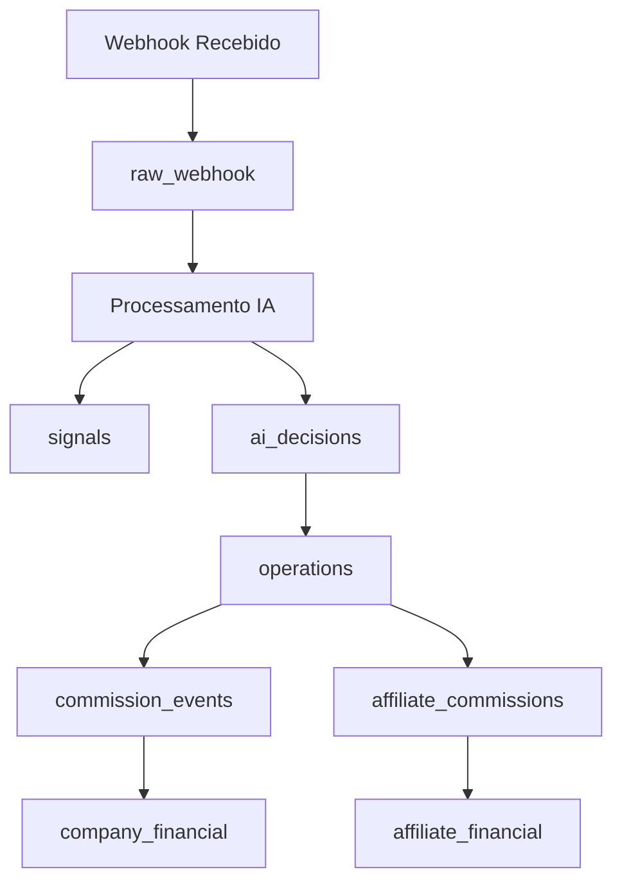

# 📊 Estrutura Completa do Banco de Dados - CoinBitClub Market Bot

## 🎯 Visão Geral

O banco de dados PostgreSQL Railway possui **42 tabelas principais** organizadas em 8 módulos funcionais, além de 16 views para consultas otimizadas e 4 funções de trigger para automação de processos financeiros.

---

## 📋 **1. USUÁRIOS E AUTENTICAÇÃO** (5 tabelas)

### 👤 `users`
**Função:** Tabela central de usuários do sistema
```sql
- id (UUID): Identificador único
- email (VARCHAR): Email único do usuário 
- password/password_hash (VARCHAR): Senhas criptografadas
- role (ENUM): user, admin, super_admin
- status (ENUM): trial_active, active, inactive, suspended
- trial_ends_at (TIMESTAMP): Fim do período trial
- name (TEXT): Nome completo
- affiliate_id (INTEGER): Referência ao afiliado que indicou
- is_affiliate (BOOLEAN): Se o usuário é afiliado
- email_verified_at, last_login_at (TIMESTAMP): Controle de acesso
```

### ⚙️ `user_settings`  
**Função:** Configurações personalizadas por usuário
```sql
- user_id (UUID): Referência ao usuário
- sizing_override (INTEGER): Tamanho personalizado de posição (padrão: 30)
- leverage_override (INTEGER): Alavancagem personalizada (padrão: 6)
```

### 🔑 `user_credentials`
**Função:** Credenciais de exchange por usuário
```sql
- id (UUID): Identificador único
- user_id (UUID): Referência ao usuário
- exchange (VARCHAR): Nome da exchange (Binance, Bybit, etc.)
- api_key, api_secret (TEXT): Chaves da API
- is_testnet (BOOLEAN): Se é ambiente de teste
```

### 💰 `user_financial`
**Função:** Situação financeira individual dos usuários
```sql
- id (UUID): Identificador único
- user_id (UUID): Referência ao usuário
- balance (NUMERIC): Saldo disponível
- profit (NUMERIC): Lucro acumulado
- locked (NUMERIC): Saldo bloqueado/reservado
```

### 📋 `credentials` (legacy)
**Função:** Tabela antiga de credenciais (mantida para compatibilidade)
```sql
- Similar à user_credentials mas com ID integer
```

---

## 📊 **2. PLANOS E ASSINATURAS** (2 tabelas)

### 📦 `plans`
**Função:** Planos de assinatura disponíveis
```sql
- id (UUID): Identificador único
- name (VARCHAR): Nome do plano
- price_id (VARCHAR): ID do preço
- currency (CHAR): Moeda (BRL, USD, etc.)
- unit_amount (NUMERIC): Valor do plano
- stripe_product_id, stripe_price_id_monthly, stripe_price_id_yearly (TEXT): Integração Stripe
- features (JSON): Funcionalidades do plano
```

### 📝 `subscriptions`
**Função:** Assinaturas ativas dos usuários
```sql
- id (UUID): Identificador único
- user_id (UUID): Referência ao usuário
- plan_id (UUID): Referência ao plano
- status (ENUM): active, inactive, cancelled, past_due
- started_at, ends_at (TIMESTAMP): Período da assinatura
- current_period_start, current_period_end (TIMESTAMP): Período atual
- trial_ends_at (TIMESTAMP): Fim do trial
```

---

## 🤖 **3. SINAIS E INTELIGÊNCIA ARTIFICIAL** (9 tabelas)

### 📡 `raw_webhook`
**Função:** Recepção bruta de webhooks de sinais
```sql
- id (INTEGER): Identificador sequencial
- source (TEXT): Origem do sinal (TradingView, Cointars)
- payload (JSONB): Dados completos do webhook
- received_at (TIMESTAMP): Momento da recepção
- status (TEXT): pending, processed, error
- processed_at (TIMESTAMP): Momento do processamento
```

### 📈 `signals`
**Função:** Sinais processados e estruturados
```sql
- id (INTEGER): Identificador sequencial
- id_uuid (UUID): Identificador único UUID
- type (TEXT): Tipo do sinal (BUY, SELL, LONG, SHORT)
- symbol (TEXT): Par de negociação (BTCUSDT, ETHUSDT)
- price (NUMERIC): Preço do sinal
- strategy (VARCHAR): Estratégia utilizada
- accuracy (NUMERIC): Precisão da estratégia
- raw_id (INTEGER): Referência ao webhook original
- processed_at (TIMESTAMP): Momento do processamento
```

### 🧠 `ai_decisions`
**Função:** Decisões tomadas pela IA para cada sinal
```sql
- id (INTEGER): Identificador sequencial
- signal_id (TEXT): Referência ao sinal
- symbol (TEXT): Par de negociação
- decision (TEXT): ACCEPT, REJECT, HOLD
- confidence (NUMERIC): Nível de confiança da IA (0-100%)
```

### 🎯 `ingestor_strategies`
**Função:** Estratégias de ingestão de sinais
```sql
- id (UUID): Identificador único
- name (VARCHAR): Nome da estratégia
- description (TEXT): Descrição detalhada
- is_active (BOOLEAN): Se está ativa
- source (VARCHAR): TRADINGVIEW, COINTARS, CUSTOM
- config (JSONB): Configurações específicas
- accuracy (NUMERIC): Precisão histórica
- signals_today (INTEGER): Sinais gerados hoje
- last_signal_at (TIMESTAMP): Último sinal gerado
```

### 📊 `market_readings`
**Função:** Leituras de mercado da IA
```sql
- id (UUID): Identificador único
- direction (VARCHAR): LONG, SHORT, NEUTRO
- confidence (NUMERIC): Nível de confiança (0-100%)
- ai_justification (TEXT): Justificativa da IA
- day_tracking (TEXT): Acompanhamento do dia
- market_data (JSONB): Dados adicionais do mercado
```

### 🪙 `cointars`
**Função:** Dados específicos da plataforma Cointars
```sql
- id (INTEGER): Identificador sequencial
- name (TEXT): Nome do ativo
- symbol (TEXT): Símbolo de negociação
- price (NUMERIC): Preço atual
- related_operation (UUID): Operação relacionada
```

### 📋 `ai_logs`
**Função:** Logs detalhados de requisições da IA
```sql
- id (BIGINT): Identificador sequencial
- request (JSONB): Dados da requisição
- response (JSONB): Resposta recebida
- timestamp (TIMESTAMP): Momento da interação
```

### 🤖 `openai_logs`
**Função:** Logs específicos do OpenAI
```sql
- Similar ao ai_logs mas específico para OpenAI
```

### 📊 `ai_reports`
**Função:** Relatórios periódicos gerados pela IA
```sql
- id (INTEGER): Identificador sequencial
- report_type (TEXT): Tipo do relatório
- period (TEXT): Período analisado
- data (JSONB): Dados do relatório
```

---

## 💼 **4. OPERAÇÕES E ORDENS** (2 tabelas)

### 🎯 `operations`
**Função:** Operações de trading executadas
```sql
- id (UUID): Identificador único
- user_id (UUID): Referência ao usuário
- symbol (TEXT): Par negociado
- side (TEXT): LONG, SHORT
- entry_price, exit_price (NUMERIC): Preços de entrada e saída
- profit_usd (NUMERIC): Lucro/prejuízo em USD
- opened_at, closed_at (TIMESTAMP): Momentos de abertura e fechamento
- status (TEXT): ACTIVE, PENDING, CLOSED
- signal_id (UUID): Referência ao sinal origem
```

### 📋 `orders`
**Função:** Ordens individuais nas exchanges
```sql
- id (INTEGER): Identificador sequencial
- user_id (UUID): Referência ao usuário
- exchange (TEXT): Nome da exchange
- symbol (TEXT): Par negociado
- side (TEXT): BUY, SELL
- type (TEXT): MARKET, LIMIT, STOP
- status (TEXT): PENDING, FILLED, CANCELLED
- exchange_order_id (TEXT): ID na exchange
- price, quantity (NUMERIC): Preço e quantidade
- profit_loss, profit_loss_percentage (NUMERIC): P&L da ordem
```

---

## 💰 **5. SISTEMA FINANCEIRO** (6 tabelas)

### 🏢 `company_financial`
**Função:** Fluxo financeiro da empresa
```sql
- id (UUID): Identificador único
- type (TEXT): entrada, pagamento_usuario, pagamento_afiliado, retirada_empresa, reserva
- description (TEXT): Descrição da movimentação
- amount (NUMERIC): Valor
- currency (TEXT): Moeda (BRL, USD)
- related_user_id (UUID): Usuário relacionado
- related_affiliate_id (UUID): Afiliado relacionado
- reference_operation (UUID): Operação de referência
```

### 💸 `commission_events`
**Função:** Eventos de comissão do sistema
```sql
- id (UUID): Identificador único
- operation_id (UUID): Operação origem
- user_id (UUID): Usuário que gerou
- commission_percent (NUMERIC): Percentual de comissão
- profit_usd (NUMERIC): Lucro base
- commission_usd (NUMERIC): Comissão em USD
- commission_converted (NUMERIC): Comissão convertida
- currency (TEXT): Moeda da conversão
- conversion_rate (NUMERIC): Taxa de conversão
```

### 💱 `exchange_rates`
**Função:** Taxas de câmbio históricas
```sql
- id (INTEGER): Identificador sequencial
- from_currency, to_currency (TEXT): Moedas de origem e destino
- rate (NUMERIC): Taxa de conversão
- reference_date (DATE): Data de referência
```

### 🔄 `refund_requests`
**Função:** Solicitações de reembolso
```sql
- id (UUID): Identificador único
- user_id (UUID): Usuário solicitante
- amount_requested (NUMERIC): Valor solicitado
- currency (TEXT): Moeda do reembolso
- status (TEXT): pending, approved, rejected, processed
```

### 💰 `commissions`
**Função:** Comissões genéricas do sistema
```sql
- id (UUID): Identificador único
- type (ENUM): Tipo da comissão
- amount (NUMERIC): Valor
- meta (JSONB): Metadados adicionais
```

### 🎯 `enhanced_features`
**Função:** Funcionalidades avançadas por usuário
```sql
- id (INTEGER): Identificador sequencial
- user_id (INTEGER): Referência ao usuário
- feature_name (TEXT): Nome da funcionalidade
- value (TEXT): Valor/configuração
```

---

## 🤝 **6. SISTEMA DE AFILIADOS** (6 tabelas)

### 👥 `affiliates`
**Função:** Registro de afiliados
```sql
- id (INTEGER): Identificador sequencial
- user_id (UUID): Referência ao usuário afiliado
- code (TEXT): Código único do afiliado
- parent_affiliate_id (UUID): Afiliado pai (multinível)
```

### 💵 `affiliate_commissions`
**Função:** Comissões dos afiliados
```sql
- id (UUID): Identificador único
- operation_id (UUID): Operação origem
- affiliate_id (UUID): Afiliado beneficiário
- referred_user_id (UUID): Usuário indicado
- profit_usd (NUMERIC): Lucro base
- commission_usd (NUMERIC): Comissão em USD
```

### 💰 `affiliate_financial`
**Função:** Situação financeira dos afiliados
```sql
- id (UUID): Identificador único
- affiliate_id (UUID): Referência ao afiliado
- credits (NUMERIC): Créditos disponíveis
```

### 🎁 `affiliate_commission_credits`
**Função:** Créditos de comissão por indicação
```sql
- id (UUID): Identificador único
- affiliate_id (UUID): Afiliado beneficiário
- user_id (UUID): Usuário que gerou o crédito
- amount (NUMERIC): Valor do crédito
```

### 📊 `affiliate_settlements`
**Função:** Liquidações de pagamentos de afiliados
```sql
- id (UUID): Identificador único
- affiliate_id (UUID): Afiliado
- total_due (NUMERIC): Total devido
- currency (TEXT): Moeda
- paid (BOOLEAN): Se foi pago
- paid_at (TIMESTAMP): Momento do pagamento
- reference_period (TEXT): Período de referência
```

### 📋 `affiliate_commissions_old` (legacy)
**Função:** Tabela antiga de comissões (mantida para histórico)

---

## 📱 **7. SISTEMA DE NOTIFICAÇÕES** (1 tabela)

### 🔔 `notifications`
**Função:** Notificações para usuários
```sql
- id (UUID): Identificador único
- user_id (UUID): Destinatário
- type (VARCHAR): Tipo da notificação
- message (TEXT): Conteúdo da mensagem
- status (ENUM): pending, sent, read, failed
```

---

## 📝 **8. LOGS E AUDITORIA** (6 tabelas)

### 🗒️ `system_logs`
**Função:** Logs gerais do sistema
```sql
- id (INTEGER): Identificador sequencial
- level (TEXT): debug, info, warn, error
- message (TEXT): Mensagem do log
- context (JSONB): Contexto adicional
```

### 🤖 `bot_logs`
**Função:** Logs específicos do bot de trading
```sql
- id (BIGINT): Identificador sequencial
- level (VARCHAR): Nível do log
- message (TEXT): Mensagem
- meta (JSONB): Metadados
- timestamp (TIMESTAMP): Momento do log
```

### 📊 `event_logs`
**Função:** Logs de eventos importantes
```sql
- id (BIGINT): Identificador sequencial
- event_type (VARCHAR): Tipo do evento
- message (TEXT): Descrição
- meta (JSONB): Dados adicionais
```

### 🔍 `audit_logs`
**Função:** Auditoria de mudanças no sistema
```sql
- id (INTEGER): Identificador sequencial
- user_id (INTEGER): Usuário que fez a alteração
- action (TEXT): Ação realizada
- table_name (TEXT): Tabela afetada
- record_id (INTEGER): Registro alterado
- old_value, new_value (JSONB): Valores antes e depois
```

### ⚙️ `knex_migrations`
**Função:** Controle de migrações do banco
```sql
- id (INTEGER): Identificador sequencial
- name (VARCHAR): Nome da migração
- batch (INTEGER): Lote da migração
- migration_time (TIMESTAMP): Momento da execução
```

### 🔒 `knex_migrations_lock`
**Função:** Lock para execução de migrações
```sql
- index (INTEGER): Identificador
- is_locked (INTEGER): Status do lock
```

---

## 📊 **VIEWS PRINCIPAIS** (16 views)

### 👥 **Análise de Usuários**
- `vw_user_plans` - Usuários com seus planos e informações financeiras
- `vw_user_operations` - Operações por usuário
- `vw_user_commissions` - Comissões por usuário
- `vw_user_credentials` - Credenciais por usuário
- `vw_user_financial_summary` - Resumo financeiro por usuário

### 🤝 **Análise de Afiliados**
- `vw_affiliate_summary` - Resumo geral de afiliados
- `vw_affiliate_commissions` - Detalhes de comissões de afiliados
- `vw_affiliate_earnings` - Ganhos de afiliados
- `vw_affiliate_financial_summary` - Situação financeira de afiliados
- `vw_afiliado_fluxo_mensal` - Fluxo mensal de afiliados

### 🏢 **Análise Empresarial**
- `vw_company_balance` - Balanço geral da empresa
- `vw_company_balance_por_moeda` - Balanço por moeda
- `vw_company_monthly_flow` - Fluxo mensal da empresa
- `vw_entradas_empresa` - Entradas financeiras
- `vw_saidas_empresa` - Saídas financeiras

### 📊 **Análise Operacional**
- `vw_operations_summary` - Resumo de operações
- `vw_operacao_detalhada` - Detalhes completos de operações
- `vw_analise_sinais_aproveitamento` - Análise de aproveitamento de sinais
- `vw_fluxo_por_plano` - Fluxo financeiro por plano
- `vw_pendencias_financeiras` - Pendências financeiras

---

## ⚙️ **FUNÇÕES DE TRIGGER** (4 funções)

### 💰 `fn_track_company_revenue()`
**Disparo:** Após inserção em `commission_events`
**Função:** Registra entrada financeira da empresa automaticamente

### 💸 `fn_apply_commissions_on_operation()`  
**Disparo:** Após inserção em `operations`
**Função:** Calcula e aplica comissões da empresa e afiliados automaticamente

### 🔄 `fn_reserve_on_refund_request()`
**Disparo:** Após inserção em `refund_requests`
**Função:** Reserva saldo da empresa para reembolsos solicitados

### ✅ `fn_clear_reserve_on_payment()`
**Disparo:** Após pagamento a usuário/afiliado
**Função:** Remove reserva após pagamento efetivado

---

## 🎯 **FLUXO DE DADOS PRINCIPAL**



---

## 📋 **ESTATÍSTICAS DO BANCO**

- **Total de Tabelas:** 42
- **Total de Views:** 16  
- **Total de Funções:** 4
- **Total de Triggers:** 7
- **Extensões:** pgcrypto
- **Índices:** 25+ índices otimizados
- **Relacionamentos:** 30+ foreign keys

---

## 🚀 **PRINCIPAIS CASOS DE USO**

1. **Trading Automatizado:** signals → ai_decisions → operations
2. **Sistema de Comissões:** operations → commission_events → company_financial
3. **Programa de Afiliados:** users → affiliate_commissions → affiliate_settlements
4. **Gestão Financeira:** commission_events ← → company_financial ← → user_financial
5. **Auditoria Completa:** audit_logs + system_logs + event_logs
6. **Análise de Performance:** Views especializadas para relatórios

Este banco de dados foi projetado para suportar um sistema completo de trading automatizado com gestão financeira robusta, programa de afiliados e auditoria detalhada! 🎯
