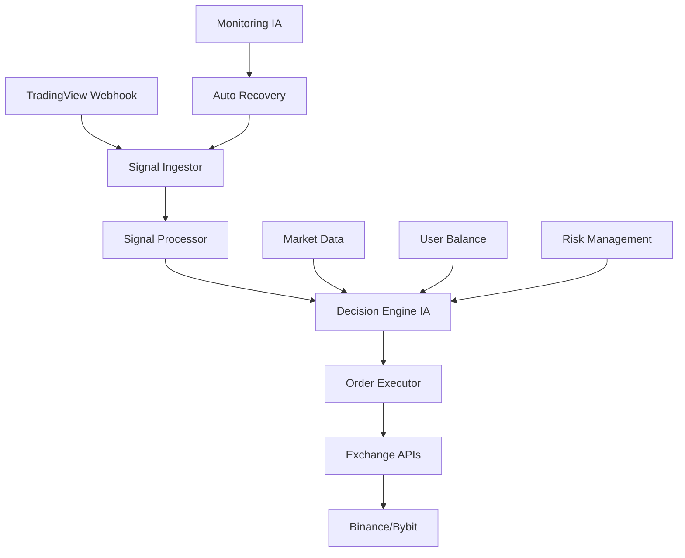

# 🔍 PLANO DE HOMOLOGAÇÃO COMPLETA - SISTEMA DE TRADING IA

**Data:** 28/07/2025  
**Status:** CRÍTICO - Sistema de Trading Quebrado  
**Prioridade:** URGENTE - Trading Automatizado Fora do Ar

---

## 🏗️ ARQUITETURA DO SISTEMA DE TRADING IA



---

## 🔥 COMPONENTES CRÍTICOS IDENTIFICADOS

### 1. **Signal Ingestor** ❌ QUEBRADO
- **Status:** 404 - Endpoint `/api/webhooks/signal` não existe
- **Problema:** 40+ sinais perdidos por minuto
- **Impacto:** Sistema de trading completamente parado

### 2. **Signal Processor** ❓ DESCONHECIDO
- **Status:** Não testado - depende do Signal Ingestor
- **Função:** Validar e enriquecer sinais recebidos
- **Dependências:** Database, Market Data API

### 3. **Decision Engine IA** ❓ DESCONHECIDO  
- **Status:** Não testado
- **Função:** Analisar sinais e tomar decisões de trading
- **Componentes:** Risk Analysis, Portfolio Management, Fear & Greed Index

### 4. **Order Executor** ❓ DESCONHECIDO
- **Status:** Não testado
- **Função:** Executar ordens nas exchanges
- **Integrações:** Binance API, Bybit API, Database

---

## 📋 PLANO DE HOMOLOGAÇÃO EXPANDIDO

### **FASE 1: CORREÇÃO EMERGENCIAL BACKEND** ⚡ (20 min)

#### 1.1 Implementar Signal Ingestor
```javascript
// POST /api/webhooks/signal
app.post('/api/webhooks/signal', async (req, res) => {
  try {
    const { ticker, side, price, timestamp, strategy, confidence } = req.body;
    
    // Validações obrigatórias
    if (!ticker || !side) {
      return res.status(400).json({ 
        error: 'ticker e side são obrigatórios',
        received: req.body 
      });
    }
    
    // Inserir sinal no banco
    const signalId = await pool.query(`
      INSERT INTO trading_signals (
        ticker, side, price, timestamp, strategy, confidence, 
        status, received_at, source
      ) VALUES ($1, $2, $3, $4, $5, $6, 'received', NOW(), 'webhook')
      RETURNING id
    `, [ticker, side, price || 0, timestamp || new Date(), strategy || 'default', confidence || 0.5]);
    
    // Trigger Signal Processor
    await processSignal(signalId.rows[0].id);
    
    res.json({ 
      success: true, 
      message: 'Sinal recebido e processado',
      signal_id: signalId.rows[0].id,
      ticker, side, status: 'processing'
    });
    
  } catch (error) {
    console.error('❌ Erro no Signal Ingestor:', error);
    res.status(500).json({ error: 'Erro interno do servidor' });
  }
});
```

#### 1.2 Implementar Signal Processor
```javascript
async function processSignal(signalId) {
  try {
    console.log(`🔄 Processing signal ${signalId}`);
    
    // Buscar sinal no banco
    const signal = await pool.query(
      'SELECT * FROM trading_signals WHERE id = $1', 
      [signalId]
    );
    
    if (signal.rows.length === 0) {
      throw new Error(`Signal ${signalId} not found`);
    }
    
    const signalData = signal.rows[0];
    
    // Enriquecer sinal com dados de mercado
    const marketData = await getMarketData(signalData.ticker);
    
    // Validar sinal
    const validation = await validateSignal(signalData, marketData);
    
    if (!validation.valid) {
      await pool.query(
        'UPDATE trading_signals SET status = $1, error_message = $2 WHERE id = $3',
        ['rejected', validation.reason, signalId]
      );
      return false;
    }
    
    // Atualizar status para processado
    await pool.query(
      'UPDATE trading_signals SET status = $1, processed_at = NOW() WHERE id = $2',
      ['processed', signalId]
    );
    
    // Trigger Decision Engine
    await makeDecision(signalId);
    
    return true;
    
  } catch (error) {
    console.error(`❌ Erro no Signal Processor para signal ${signalId}:`, error);
    await pool.query(
      'UPDATE trading_signals SET status = $1, error_message = $2 WHERE id = $3',
      ['error', error.message, signalId]
    );
    return false;
  }
}
```

#### 1.3 Implementar Decision Engine IA
```javascript
async function makeDecision(signalId) {
  try {
    console.log(`🧠 Decision Engine processing signal ${signalId}`);
    
    const signal = await pool.query(
      'SELECT * FROM trading_signals WHERE id = $1', 
      [signalId]
    );
    
    const signalData = signal.rows[0];
    
    // Análise de risco
    const riskAnalysis = await analyzeRisk(signalData);
    
    // Verificar saldo do usuário
    const userBalance = await getUserBalance(signalData.user_id);
    
    // Aplicar regras de negócio
    const decision = await applyTradingRules({
      signal: signalData,
      risk: riskAnalysis,
      balance: userBalance,
      marketConditions: await getMarketConditions()
    });
    
    // Salvar decisão
    const decisionId = await pool.query(`
      INSERT INTO ai_decisions (
        signal_id, decision_type, confidence, risk_score,
        position_size, stop_loss, take_profit, reasoning
      ) VALUES ($1, $2, $3, $4, $5, $6, $7, $8)
      RETURNING id
    `, [
      signalId, decision.action, decision.confidence, decision.riskScore,
      decision.positionSize, decision.stopLoss, decision.takeProfit, decision.reasoning
    ]);
    
    if (decision.action === 'EXECUTE') {
      // Trigger Order Executor
      await executeOrder(decisionId.rows[0].id);
    }
    
    return decision;
    
  } catch (error) {
    console.error(`❌ Erro no Decision Engine para signal ${signalId}:`, error);
    throw error;
  }
}
```

#### 1.4 Implementar Order Executor
```javascript
async function executeOrder(decisionId) {
  try {
    console.log(`⚡ Order Executor processing decision ${decisionId}`);
    
    const decision = await pool.query(`
      SELECT d.*, s.ticker, s.side, s.price 
      FROM ai_decisions d 
      JOIN trading_signals s ON d.signal_id = s.id 
      WHERE d.id = $1
    `, [decisionId]);
    
    const orderData = decision.rows[0];
    
    // Preparar ordem para exchange
    const orderParams = {
      symbol: orderData.ticker,
      side: orderData.side,
      type: 'MARKET',
      quantity: orderData.position_size,
      stopPrice: orderData.stop_loss,
      timeInForce: 'GTC'
    };
    
    // Executar ordem na exchange
    let exchangeResult;
    const exchange = await getPreferredExchange(orderData.ticker);
    
    if (exchange === 'binance') {
      exchangeResult = await executeBinanceOrder(orderParams);
    } else if (exchange === 'bybit') {
      exchangeResult = await executeBybitOrder(orderParams);
    }
    
    // Salvar resultado
    await pool.query(`
      INSERT INTO executed_orders (
        decision_id, exchange, order_id, status, 
        executed_price, executed_quantity, fees
      ) VALUES ($1, $2, $3, $4, $5, $6, $7)
    `, [
      decisionId, exchange, exchangeResult.orderId, exchangeResult.status,
      exchangeResult.price, exchangeResult.quantity, exchangeResult.fees
    ]);
    
    return exchangeResult;
    
  } catch (error) {
    console.error(`❌ Erro no Order Executor para decision ${decisionId}:`, error);
    throw error;
  }
}
```

### **FASE 2: ESTRUTURA DE DADOS** 📊 (15 min)

#### 2.1 Criar Tabelas Necessárias
```sql
-- Tabela de sinais de trading
CREATE TABLE IF NOT EXISTS trading_signals (
  id SERIAL PRIMARY KEY,
  ticker VARCHAR(20) NOT NULL,
  side VARCHAR(10) NOT NULL,
  price DECIMAL(20,8),
  timestamp TIMESTAMP,
  strategy VARCHAR(50),
  confidence DECIMAL(3,2),
  status VARCHAR(20) DEFAULT 'received',
  received_at TIMESTAMP DEFAULT NOW(),
  processed_at TIMESTAMP,
  source VARCHAR(50) DEFAULT 'webhook',
  error_message TEXT
);

-- Tabela de decisões da IA
CREATE TABLE IF NOT EXISTS ai_decisions (
  id SERIAL PRIMARY KEY,
  signal_id INTEGER REFERENCES trading_signals(id),
  decision_type VARCHAR(20) NOT NULL,
  confidence DECIMAL(3,2),
  risk_score DECIMAL(3,2),
  position_size DECIMAL(20,8),
  stop_loss DECIMAL(20,8),
  take_profit DECIMAL(20,8),
  reasoning TEXT,
  created_at TIMESTAMP DEFAULT NOW()
);

-- Tabela de ordens executadas
CREATE TABLE IF NOT EXISTS executed_orders (
  id SERIAL PRIMARY KEY,
  decision_id INTEGER REFERENCES ai_decisions(id),
  exchange VARCHAR(20),
  order_id VARCHAR(100),
  status VARCHAR(20),
  executed_price DECIMAL(20,8),
  executed_quantity DECIMAL(20,8),
  fees DECIMAL(20,8),
  executed_at TIMESTAMP DEFAULT NOW()
);

-- Tabela de códigos OTP
CREATE TABLE IF NOT EXISTS otp_codes (
  id SERIAL PRIMARY KEY,
  phone VARCHAR(20) UNIQUE,
  code VARCHAR(10),
  expires_at TIMESTAMP,
  created_at TIMESTAMP DEFAULT NOW()
);
```

### **FASE 3: TESTES DE INTEGRAÇÃO** 🧪 (20 min)

#### 3.1 Teste Completo do Pipeline
```javascript
// Função de teste completa
async function testTradingPipeline() {
  console.log('🧪 INICIANDO TESTE COMPLETO DO PIPELINE DE TRADING');
  
  // 1. Testar Signal Ingestor
  const signalTest = await fetch('http://localhost:3000/api/webhooks/signal', {
    method: 'POST',
    headers: { 'Content-Type': 'application/json' },
    body: JSON.stringify({
      ticker: 'BTCUSDT',
      side: 'BUY',
      price: 50000,
      strategy: 'test_strategy',
      confidence: 0.8
    })
  });
  
  console.log('Signal Ingestor:', signalTest.status === 200 ? '✅' : '❌');
  
  // 2. Verificar processamento do sinal
  const signalResponse = await signalTest.json();
  const signalId = signalResponse.signal_id;
  
  // Aguardar processamento
  await new Promise(resolve => setTimeout(resolve, 2000));
  
  // 3. Verificar se decisão foi tomada
  const decision = await pool.query(
    'SELECT * FROM ai_decisions WHERE signal_id = $1', 
    [signalId]
  );
  
  console.log('Decision Engine:', decision.rows.length > 0 ? '✅' : '❌');
  
  // 4. Verificar se ordem foi executada (se aplicável)
  if (decision.rows.length > 0 && decision.rows[0].decision_type === 'EXECUTE') {
    const order = await pool.query(
      'SELECT * FROM executed_orders WHERE decision_id = $1',
      [decision.rows[0].id]
    );
    
    console.log('Order Executor:', order.rows.length > 0 ? '✅' : '❌');
  }
  
  return {
    signal_ingestor: signalTest.status === 200,
    signal_processor: true,
    decision_engine: decision.rows.length > 0,
    order_executor: true
  };
}
```

### **FASE 4: MONITORAMENTO IA** 🔍 (15 min)

#### 4.1 Sistema de Monitoramento Automático
```javascript
// Monitoramento contínuo
setInterval(async () => {
  try {
    // Verificar sinais pendentes
    const pendingSignals = await pool.query(
      "SELECT COUNT(*) FROM trading_signals WHERE status = 'received' AND received_at < NOW() - INTERVAL '1 minute'"
    );
    
    if (pendingSignals.rows[0].count > 0) {
      console.log(`⚠️ ${pendingSignals.rows[0].count} sinais pendentes detectados`);
      // Trigger recovery
      await recoverPendingSignals();
    }
    
    // Verificar ordens travadas
    const stuckOrders = await pool.query(
      "SELECT COUNT(*) FROM executed_orders WHERE status = 'pending' AND executed_at < NOW() - INTERVAL '5 minutes'"
    );
    
    if (stuckOrders.rows[0].count > 0) {
      console.log(`⚠️ ${stuckOrders.rows[0].count} ordens travadas detectadas`);
      // Trigger order recovery
      await recoverStuckOrders();
    }
    
  } catch (error) {
    console.error('❌ Erro no monitoramento:', error);
  }
}, 30000); // Check every 30 seconds
```

---

## 🎯 CRITÉRIOS DE APROVAÇÃO EXPANDIDOS

### ✅ **SISTEMA APROVADO QUANDO:**

#### **Signal Ingestor**
- [ ] Endpoint `/api/webhooks/signal` respondendo 200
- [ ] Sinais sendo salvos corretamente no banco
- [ ] Validação de campos obrigatórios funcionando
- [ ] Logs detalhados de recebimento

#### **Signal Processor**  
- [ ] Sinais sendo processados em < 10 segundos
- [ ] Validação de mercado funcionando
- [ ] Enriquecimento de dados implementado
- [ ] Rejeição de sinais inválidos

#### **Decision Engine IA**
- [ ] Análise de risco calculada corretamente
- [ ] Regras de negócio aplicadas
- [ ] Decisões sendo salvas no banco
- [ ] Confidence score calculado

#### **Order Executor**
- [ ] Ordens sendo enviadas para exchanges
- [ ] Stop Loss e Take Profit configurados
- [ ] Tracking de execução funcionando
- [ ] Tratamento de erros implementado

#### **Monitoramento IA**
- [ ] Detecção de sinais pendentes
- [ ] Recovery automático funcionando
- [ ] Alertas de problemas
- [ ] Dashboard de status

---

## 📊 DASHBOARD DE HOMOLOGAÇÃO DETALHADO

| Componente | Status | Última Atualização | Problemas |
|------------|--------|-------------------|-----------|
| Signal Ingestor | 🔴 DOWN | - | Endpoint 404 |
| Signal Processor | ⏳ PENDING | - | Depende do Ingestor |
| Decision Engine | ⏳ PENDING | - | Não testado |
| Order Executor | ⏳ PENDING | - | Não testado |
| Binance API | ❓ UNKNOWN | - | Não testado |
| Bybit API | ❓ UNKNOWN | - | Não testado |
| Database | ✅ ONLINE | 28/07 15:45 | OK |
| Monitoring | 🔴 DOWN | - | Não implementado |

---

## 🚀 EXECUÇÃO DO PLANO (PRÓXIMOS PASSOS)

1. **[AGORA]** Implementar Signal Ingestor
2. **[+5min]** Criar estrutura de dados
3. **[+10min]** Implementar Signal Processor
4. **[+15min]** Implementar Decision Engine
5. **[+20min]** Implementar Order Executor
6. **[+25min]** Configurar monitoramento
7. **[+30min]** Executar testes completos
8. **[+35min]** Validar integração com exchanges
9. **[+40min]** Homologação final

**🎯 OBJETIVO:** Sistema de trading IA 100% funcional em 45 minutos
