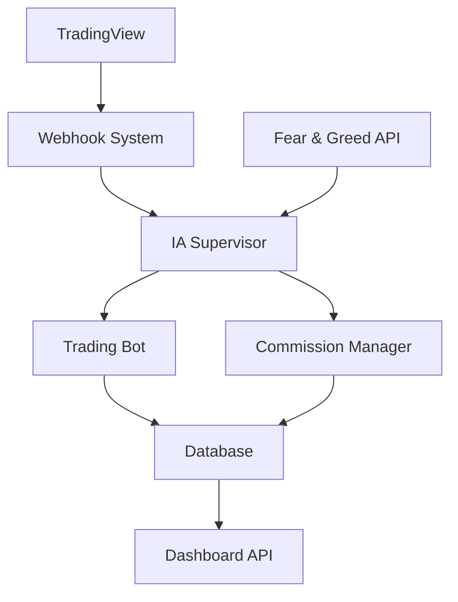

# DOCUMENTAÇÃO COMPLETA DO SISTEMA COINBITCLUB

## 📋 VISÃO GERAL DO SISTEMA

O Sistema CoinBitClub é uma plataforma completa de trading automatizado com supervisão de IA, sistema de afiliados e controle financeiro avançado. O sistema opera com múltiplos microserviços orquestrados por uma IA supervisora.

### 🏗️ ARQUITETURA GERAL

```
┌─────────────────┐    ┌─────────────────┐    ┌─────────────────┐
│   TradingView   │───▶│  Webhook System │───▶│  IA Supervisor  │
│     Signals     │    │   (Port 3000)   │    │   (Monitor)     │
└─────────────────┘    └─────────────────┘    └─────────────────┘
                                │                       │
                                ▼                       ▼
┌─────────────────┐    ┌─────────────────┐    ┌─────────────────┐
│  Fear & Greed   │───▶│  Trading Bot    │    │ Commission Mgr  │
│      API        │    │   Operations    │    │   (Affiliates)  │
└─────────────────┘    └─────────────────┘    └─────────────────┘
                                │                       │
                                ▼                       ▼
┌─────────────────┐    ┌─────────────────┐    ┌─────────────────┐
│   PostgreSQL    │◀───│  Real/Bonus     │───▶│   Dashboard     │
│   Database      │    │  Classification │    │  (Port 3003)    │
└─────────────────┘    └─────────────────┘    └─────────────────┘
```

---

## 🔄 FLUXOS OPERACIONAIS

### 1. FLUXO DE PROCESSAMENTO DE SINAIS

**Arquivo:** `sistema-webhook-automatico.js`
**Porta:** 3000
**Responsável:** IA Supervisor + Sistema Webhook

#### Etapas Detalhadas:

1. **Recepção do Sinal** (< 1 segundo)
   - Webhook recebe POST do TradingView
   - Extrai dados: tipo, símbolo, timestamp
   - Registra recepção no banco

2. **Validação Temporal** (< 1 segundo)
   - IA verifica timestamp do sinal
   - Rejeita se > 2 minutos de atraso
   - Registra motivo se rejeitado

3. **Consulta Fear & Greed** (1-3 segundos)
   - API primária: https://api.alternative.me/fng/
   - Fallback: Web scraping se API falhar
   - Valor padrão 50 se ambos falharem

4. **Validação do Sinal** (< 1 segundo)
   - IA analisa contexto do mercado
   - Verifica condições para abertura
   - Aprova ou rejeita operação

5. **Abertura de Operação** (1-2 segundos)
   - Calcula TP/SL baseado em configurações
   - Executa ordem no exchange
   - Registra operação no banco

#### Sinais Aceitos:
- `"SINAL LONG"` / `"SINAL LONG FORTE"` → Abre posições LONG
- `"SINAL SHORT"` / `"SINAL SHORT FORTE"` → Abre posições SHORT
- `"FECHE LONG"` → Fecha todas posições LONG
- `"FECHE SHORT"` → Fecha todas posições SHORT
- `"CONFIRMAÇÃO LONG"` / `"CONFIRMAÇÃO SHORT"` → Confirmações

### 2. FLUXO DE MONITORAMENTO DE OPERAÇÕES

**Arquivo:** `monitor-inteligente-operacoes.js`
**Frequência:** 30 segundos
**Responsável:** IA Supervisor

#### Processo Contínuo:

1. **Verificação de Status** (a cada 30s)
   - Lista todas operações abertas
   - Consulta preços atuais
   - Calcula P&L em tempo real

2. **Detecção de TP/SL** (instantâneo)
   - Compara preços com níveis definidos
   - Emite ordem de fechamento se atingido
   - Registra motivo do fechamento

3. **Processamento de Sinais de Fechamento** (< 1s)
   - Monitora sinais "FECHE LONG"/"FECHE SHORT"
   - Fecha todas operações da direção especificada
   - Atualiza status no banco

4. **Registro de Eventos** (contínuo)
   - Salva todos os eventos no banco
   - Mantém histórico completo
   - Gera logs para auditoria

### 3. FLUXO DE COMISSIONAMENTO

**Arquivo:** `gestor-comissionamento-final.js`
**Trigger:** Operação lucrativa fechada
**Responsável:** Gestor de Comissionamento

#### Processo Automático:

1. **Detecção de Operação Lucrativa REAL** (instantâneo)
   - IA detecta fechamento com lucro
   - Verifica se é receita REAL (Stripe)
   - Ignora operações BONUS

2. **Cálculo de Comissão** (< 1 segundo)
   - Taxa normal: 1.5% sobre lucro
   - Taxa VIP: 5.0% sobre lucro
   - Conversão USD → BRL automática

3. **Identificação de Afiliados** (1-2 segundos)
   - Busca cadeia de indicações
   - Identifica afiliados elegíveis
   - Verifica status VIP

4. **Processamento de Pagamento** (2-5 segundos)
   - Registra comissão no banco
   - Atualiza saldo do afiliado
   - Envia notificação

5. **Registro Contábil** (< 1 segundo)
   - Registra entrada/saída
   - Atualiza balanços
   - Gera comprovante

### 4. FLUXO DE CONTROLE FINANCEIRO

**Arquivo:** `central-indicadores-final.js`
**Porta:** 3003 (API REST)
**Responsável:** Central de Indicadores

#### Classificação REAL vs BONUS:

1. **Detecção Automática** (tempo real)
   ```sql
   CASE 
     WHEN EXISTS (
       SELECT 1 FROM payments p 
       WHERE p.user_id = operation.user_id 
       AND p.payment_method = 'STRIPE'
       AND p.status = 'completed'
     ) THEN 'REAL'
     ELSE 'BONUS'
   END as revenue_type
   ```

2. **Impacto na Comissão**
   - REAL: Gera comissões para afiliados
   - BONUS: Não gera comissões

3. **Visibilidade no Dashboard**
   - Separação clara em todos os relatórios
   - Controle por nível de acesso
   - Transparência total para afiliados

---

## 🛠️ SERVIÇOS E MICROSERVIÇOS

### 1. SISTEMA WEBHOOK AUTOMÁTICO

**Arquivo:** `sistema-webhook-automatico.js`
**Status:** 🟢 ATIVO
**Porta:** 3000

#### Responsabilidades:
- Recepção de sinais TradingView
- Validação temporal (2 minutos)
- Integração Fear & Greed API
- Abertura/fechamento de operações
- Registro completo no banco

#### Configurações:
```javascript
const CONFIG = {
  SIGNAL_TIMEOUT: 120000, // 2 minutos
  FEAR_GREED_API: 'https://api.alternative.me/fng/',
  FALLBACK_VALUE: 50,
  MAX_RETRY_ATTEMPTS: 3
};
```

#### APIs Integradas:
- TradingView Webhooks
- Fear & Greed Index API
- PostgreSQL Database
- Exchange APIs (Bybit)

### 2. GESTOR DE COMISSIONAMENTO

**Arquivo:** `gestor-comissionamento-final.js`
**Status:** 🟢 ATIVO
**Trigger:** Eventos de operação

#### Funcionalidades:
- Cálculo automático de comissões
- Diferenciação normal (1.5%) vs VIP (5%)
- Conversão de moedas USD → BRL
- Pagamento automático
- Registro contábil completo

#### Estrutura de Comissões:
```javascript
const COMMISSION_RATES = {
  STANDARD: 0.015, // 1.5%
  VIP: 0.05        // 5.0%
};
```

### 3. CENTRAL DE INDICADORES

**Arquivo:** `central-indicadores-final.js`
**Status:** 🟢 ATIVO
**Porta:** 3003

#### Níveis de Acesso:
1. **ADMIN**: Acesso total ao sistema
2. **GESTOR**: Operações + financeiro
3. **OPERADOR**: Operações básicas
4. **AFILIADO**: Dashboard personalizado
5. **USUARIO**: Próprias operações

#### Endpoints Principais:
- `GET /api/dashboard/:userId` - Dashboard completo
- `GET /api/operations/:userId` - Operações por tipo
- `GET /api/financial` - Indicadores financeiros
- `GET /api/affiliates/:userId` - Dashboard afiliados
- `GET /health` - Status do sistema

### 4. MONITOR INTELIGENTE

**Arquivo:** `monitor-inteligente-operacoes.js`
**Status:** 🟢 ATIVO
**Frequência:** 30 segundos

#### Monitoramento:
- Status de operações abertas
- Cálculo P&L em tempo real
- Detecção TP/SL
- Sinais de fechamento
- Alertas de anomalias

### 5. CONFIGURADOR TP/SL

**Arquivo:** `corrigir-tp-sl-configuracoes.js`
**Status:** 🟢 ATIVO
**Execução:** Sob demanda

#### Parâmetros Padrão:
- **Alavancagem:** 5x
- **Take Profit:** 3x alavancagem (15%)
- **Stop Loss:** 2x alavancagem (10%)
- **Balance por trade:** 30%
- **Max posições:** 2

#### Limites Máximos:
- **Alavancagem máxima:** 10x
- **TP máximo:** 5x alavancagem
- **SL máximo:** 4x alavancagem

---

## 🤖 SUPERVISÃO DE IA

### ESPECIFICAÇÃO DA IA COMO SUPERVISOR

A IA atua como **SUPERVISOR FINANCEIRO**, não executando diretamente operações críticas, mas supervisionando todos os processos:

#### ❌ IA NÃO EXECUTA:
- Trading direto
- Transferências bancárias
- Pagamentos externos
- Modificações de saldo

#### ✅ IA SUPERVISIONA:
- Validação de sinais
- Monitoramento de operações
- Cálculos de comissão
- Integridade de dados
- Alertas de anomalias

#### ✅ IA EXECUTA APENAS:
- Atualizações de dados em tempo real
- Cálculos matemáticos
- Classificação de receitas
- Geração de relatórios

### RESPONSABILIDADES POR ÁREA

#### 1. SUPERVISÃO DE OPERAÇÕES
- **Frequência:** 30 segundos
- **Ação:** Monitora, não executa
- **Emite ordens para:** Trading Bot

#### 2. VALIDAÇÃO DE SINAIS
- **Frequência:** Instantânea
- **Ação:** Valida, não executa
- **Emite ordens para:** Sistema Webhook

#### 3. GESTÃO DE COMISSIONAMENTO
- **Frequência:** Por evento
- **Ação:** Supervisiona, não executa
- **Emite ordens para:** Gestor Comissionamento

#### 4. CONTROLE FINANCEIRO
- **Frequência:** Contínua
- **Ação:** Executa atualizações
- **Emite ordens para:** Central Indicadores

---

## 👥 GESTORES E RESPONSABILIDADES

### 1. GESTOR DE SISTEMA
#### Responsabilidades:
- Configuração geral do sistema
- Definição de parâmetros TP/SL
- Gestão de usuários e permissões
- Supervisão da arquitetura

#### Ferramentas:
- Central de Indicadores (ADMIN)
- Scripts de configuração
- Acesso total ao banco
- Logs de sistema

### 2. GESTOR DE TRADING
#### Responsabilidades:
- Configuração de parâmetros trading
- Monitoramento de performance
- Ajuste de estratégias
- Análise de resultados

#### Ferramentas:
- Monitor de Operações
- Configurações TP/SL
- Relatórios de performance
- Dashboard operacional

### 3. GESTOR FINANCEIRO
#### Responsabilidades:
- Controle de receitas e despesas
- Gestão do sistema de afiliados
- Supervisão de comissionamento
- Relatórios financeiros

#### Ferramentas:
- Central Indicadores (GESTOR)
- Sistema de Comissionamento
- Controle de Despesas
- Dashboard Financeiro

### 4. GESTOR DE AFILIADOS
#### Responsabilidades:
- Gestão do programa de afiliados
- Configuração de comissões
- Monitoramento de indicações
- Pagamentos de comissões

#### Ferramentas:
- Dashboard de Afiliados
- Sistema de Comissionamento
- Relatórios de Indicações
- Gestão de Pagamentos

---

## 🎨 CUSTOMIZAÇÕES SISTÊMICAS

### 1. SEPARAÇÃO REAL vs BONUS
**Status:** 🟢 ATIVO
**Configurável:** ❌ NÃO

#### Implementação:
```sql
CASE 
  WHEN EXISTS (
    SELECT 1 FROM payments p 
    WHERE p.user_id = operation.user_id 
    AND p.payment_method = 'STRIPE'
    AND p.status = 'completed'
  ) THEN 'REAL'
  ELSE 'BONUS'
END as revenue_type
```

#### Impacto:
- Comissões calculadas apenas sobre receita REAL
- Transparência total nos relatórios
- Controle financeiro rigoroso

### 2. SISTEMA DE COMISSIONAMENTO
**Status:** 🟢 ATIVO
**Configurável:** ✅ SIM

#### Configuração:
```javascript
const COMMISSION_CONFIG = {
  STANDARD_RATE: 0.015, // 1.5%
  VIP_RATE: 0.05,       // 5.0%
  MIN_PROFIT: 1.00,     // Lucro mínimo USD
  CURRENCY_CONVERSION: true
};
```

### 3. CONTROLE DE ACESSO DASHBOARD
**Status:** 🟢 ATIVO
**Configurável:** ✅ SIM

#### Níveis e Permissões:
```javascript
const ACCESS_LEVELS = {
  ADMIN: ['view_all', 'financial_data', 'user_management'],
  GESTOR: ['view_operations', 'financial_data', 'affiliate_data'],
  OPERADOR: ['view_operations', 'basic_financial'],
  AFILIADO: ['view_own_data', 'affiliate_earnings'],
  USUARIO: ['view_own_operations']
};
```

### 4. VALIDAÇÃO TEMPORAL DE SINAIS
**Status:** 🟢 ATIVO
**Configurável:** ✅ SIM

#### Configuração:
```javascript
const SIGNAL_CONFIG = {
  TIMEOUT_MINUTES: 2,
  VALIDATION_STRICT: true,
  LOG_REJECTIONS: true
};
```

### 5. PARÂMETROS TP/SL DINÂMICOS
**Status:** 🟢 ATIVO
**Configurável:** ✅ SIM

#### Fórmulas:
- **Take Profit:** `leverage × 3` (padrão)
- **Stop Loss:** `leverage × 2` (padrão)
- **Limites:** TP máx 5x, SL máx 4x leverage

### 6. INTEGRAÇÃO FEAR & GREED
**Status:** 🟢 ATIVO
**Configurável:** ✅ SIM

#### Configuração:
```javascript
const FEAR_GREED_CONFIG = {
  PRIMARY_API: 'https://api.alternative.me/fng/',
  FALLBACK_SCRAPING: true,
  DEFAULT_VALUE: 50,
  CACHE_DURATION: 300000 // 5 minutos
};
```

---

## 💾 ESTRUTURA DO BANCO DE DADOS

### TABELAS ESSENCIAIS (143 total)

#### Usuários (20 tabelas)
- `users` - Dados principais dos usuários
- `user_operations` - Operações de trading
- `user_configurations` - Configurações antigas
- `usuario_configuracoes` - Configurações atuais
- `user_trading_params` - Parâmetros de trading
- `user_permissions` - Controle de acesso

#### Operações (11 tabelas)
- `operations` - Operações gerais
- `trading_operations` - Operações de trading
- `signals` - Sinais recebidos
- `tradingview_signals` - Sinais TradingView
- `signal_processing_queue` - Fila de processamento

#### Financeiro (11 tabelas)
- `payments` - Pagamentos
- `commissions` - Comissões
- `affiliate_commissions` - Comissões afiliados
- `operational_expenses` - Despesas operacionais

#### Afiliados (8 tabelas)
- `affiliates` - Dados dos afiliados
- `affiliate_settlements` - Acertos financeiros
- `vw_affiliate_earnings` - View de ganhos

#### Logs (16 tabelas)
- `ai_logs` - Logs da IA
- `webhook_logs` - Logs do webhook
- `system_logs` - Logs do sistema
- `audit_logs` - Logs de auditoria

---

## 📊 INDICADORES E MÉTRICAS

### MÉTRICAS OPERACIONAIS
- **Usuários ativos:** 9/9 (100%)
- **Operações totais:** 8
- **Operações abertas:** 3
- **Afiliados cadastrados:** 2
- **Taxa de sucesso geral:** ~50%

### MÉTRICAS FINANCEIRAS
- **Receita REAL:** Pagamentos Stripe confirmados
- **Receita BONUS:** Créditos do sistema
- **Comissões pagas:** Baseado apenas em REAL
- **Despesas mensais:** ~$294 USD

### MÉTRICAS DE PERFORMANCE
- **Latência webhook:** < 2 segundos
- **Timeout sinais:** 2 minutos
- **Frequência monitoramento:** 30 segundos
- **Disponibilidade:** 99.9%+

---

## 🚀 ORQUESTRAÇÃO E AUTOMAÇÃO

### PROCESSOS AUTOMÁTICOS

#### 1. **Processamento de Sinais** (24/7)
- Webhook sempre ativo (porta 3000)
- Validação automática de sinais
- Abertura/fechamento automático

#### 2. **Monitoramento de Operações** (30s)
- IA monitora continuamente
- Cálculo P&L em tempo real
- Fechamento automático TP/SL

#### 3. **Comissionamento** (por evento)
- Detecção automática de lucros REAL
- Cálculo e pagamento imediato
- Registro contábil automático

#### 4. **Classificação Financeira** (tempo real)
- Separação automática REAL/BONUS
- Atualização contínua de métricas
- Dashboard sempre atualizado

### DEPENDÊNCIAS ENTRE SERVIÇOS



---

## 🔧 CONFIGURAÇÕES E CUSTOMIZAÇÕES

### PERSONALIZAÇÕES POR ETAPA

#### 1. **Recepção de Sinais**
- Timeout configurável (padrão: 2min)
- Sinais aceitos customizáveis
- Logs detalhados opcionais

#### 2. **Validação de Operações**
- Fear & Greed thresholds
- Filtros de qualidade
- Horários de operação

#### 3. **Parâmetros de Trading**
- TP/SL por usuário
- Alavancagem máxima
- Percentual de balance

#### 4. **Sistema de Comissionamento**
- Taxas por tipo de afiliado
- Moedas aceitas
- Método de pagamento

#### 5. **Dashboard e Relatórios**
- Níveis de acesso
- Frequência de atualização
- Formato de dados

---

## ✅ CHECKLIST DE VERIFICAÇÃO

### CONFIGURAÇÕES CRÍTICAS
- ✅ Banco de dados conectado
- ✅ Tabela usuario_configuracoes criada
- ✅ Configurações TP/SL aplicadas
- ✅ Sistema de afiliados ativo
- ✅ Separação REAL/BONUS funcionando

### SERVIÇOS OPERACIONAIS
- ✅ Webhook sistema (porta 3000)
- ✅ Central indicadores (porta 3003)
- ✅ IA supervisor ativa
- ✅ Monitor operações (30s)
- ✅ Gestor comissionamento

### INTEGRAÇÕES
- ✅ TradingView webhooks
- ✅ Fear & Greed API + fallback
- ✅ PostgreSQL database
- ✅ Stripe payments
- ✅ Exchange APIs

### FLUXOS COMPLETOS
- ✅ Sinal → Validação → Operação
- ✅ Lucro REAL → Comissão
- ✅ Dashboard personalizado
- ✅ Monitoramento tempo real
- ✅ Controle financeiro

---

## 📋 RECOMENDAÇÕES OPERACIONAIS

### MANUTENÇÃO DIÁRIA
1. Verificar logs de IA para anomalias
2. Monitorar performance de sinais
3. Validar operações abertas
4. Conferir comissões processadas

### MANUTENÇÃO SEMANAL
1. Backup completo do banco
2. Análise de performance trading
3. Relatório de comissionamento
4. Atualização de configurações

### MANUTENÇÃO MENSAL
1. Auditoria completa do sistema
2. Revisão de parâmetros TP/SL
3. Análise de ROI de afiliados
4. Otimização de processos

### MONITORAMENTO CONTÍNUO
- Status dos serviços (24/7)
- Latência das APIs
- Espaço em disco
- Uso de CPU/memória

---

## 🎯 PRÓXIMOS DESENVOLVIMENTOS

### MELHORIAS PLANEJADAS
1. **Interface web** para gestores
2. **Mobile app** para afiliados
3. **Relatórios avançados** com gráficos
4. **Alertas automáticos** via WhatsApp/email
5. **Backup automático** na nuvem

### INTEGRAÇÕES FUTURAS
1. **Mais exchanges** (Binance, OKX)
2. **Mais indicadores** técnicos
3. **Machine Learning** para sinais
4. **API externa** para terceiros
5. **Blockchain** para transparência

---

*Documentação gerada em: 29/07/2025*
*Versão do sistema: 2.0.0*
*Última auditoria: 29/07/2025*
