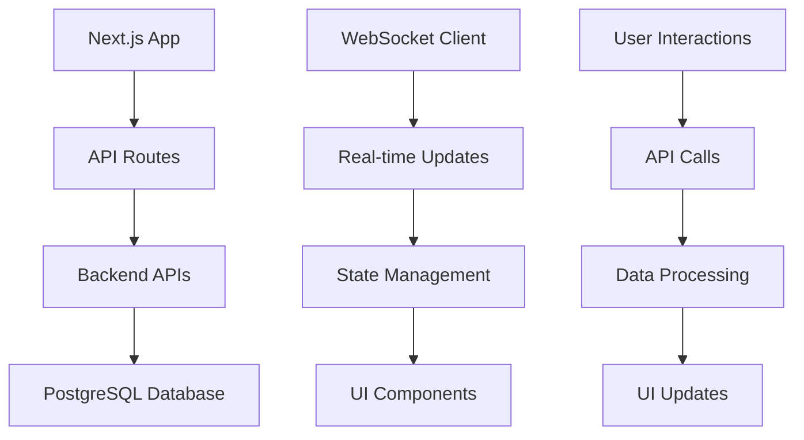

# 🖥️ CoinBitClub Market Bot - Frontend Documentation


## 📋 Índice

- [📖 Visão Geral](#visão-geral)
- [🏗️ Arquitetura Frontend](#arquitetura-frontend)
- [🚀 Instalação e Setup](#instalação-e-setup)
- [🎨 Componentes](#componentes)
- [📊 Dashboard](#dashboard)
- [🔗 Integração com APIs](#integração-com-apis)
- [📱 Responsividade](#responsividade)
- [🔧 Desenvolvimento](#desenvolvimento)

---

## 📖 Visão Geral

O frontend do CoinBitClub Market Bot é construído com **Next.js 14** e **React 18**, oferecendo uma interface moderna e responsiva para monitoramento do sistema de trading automatizado.

### 🎯 Funcionalidades Principais

- ✅ **Dashboard em Tempo Real** - Monitoramento visual completo
- ✅ **Interface Responsiva** - Mobile e desktop
- ✅ **Atualizações Live** - WebSocket para dados em tempo real
- ✅ **Visualizações Interativas** - Gráficos e métricas animadas
- ✅ **Sistema de Notificações** - Alertas visuais
- ✅ **Dark/Light Theme** - Tema adaptável

### 🌐 URLs de Acesso

- **Desenvolvimento:** http://localhost:3000
- **Dashboard Sistema:** http://localhost:3011/dashboard
- **Dashboard Teste:** http://localhost:3012
- **Produção:** https://your-railway-url.railway.app

---

## 🏗️ Arquitetura Frontend

### 📁 Estrutura de Pastas

```
frontend/
├── 📄 next.config.js           # Configuração Next.js
├── 📦 package.json             # Dependencies
├── 🎨 tailwind.config.js       # Configuração Tailwind CSS
├── 📝 tsconfig.json            # Configuração TypeScript
├── 📁 pages/                   # Páginas Next.js
│   ├── index.js               # Landing page
│   ├── dashboard.js           # Dashboard principal
│   ├── trading.js             # Interface de trading
│   ├── users.js               # Gestão de usuários
│   └── api/                   # API routes
│       ├── health.js          # Health check
│       ├── status.js          # Status sistema
│       └── monitoring/        # APIs monitoramento
├── 📁 components/              # Componentes React
│   ├── Dashboard/             # Componentes dashboard
│   ├── Trading/               # Componentes trading
│   ├── Charts/                # Gráficos e visualizações
│   ├── UI/                    # Componentes UI básicos
│   └── Layout/                # Layout components
├── 📁 hooks/                   # Custom React hooks
├── 📁 utils/                   # Utilitários frontend
├── 📁 styles/                  # Estilos CSS/SCSS
└── 📁 public/                  # Assets estáticos
    ├── images/
    ├── icons/
    └── dashboard.html         # Dashboard standalone
```

### 🔄 Fluxo de Dados



---

## 🚀 Instalação e Setup

### 📋 Pré-requisitos

```bash
# Node.js versão 18 ou superior
node --version  # >= 18.0.0

# npm ou yarn
npm --version   # >= 8.0.0
```

### 🛠️ Instalação Desenvolvimento

```bash
# 1. Navegar para pasta frontend
cd coinbitclub-market-bot/backend/frontend

# 2. Instalar dependências
npm install

# 3. Configurar variáveis de ambiente
cp .env.local.example .env.local

# 4. Executar em modo desenvolvimento
npm run dev

# 5. Acessar aplicação
# http://localhost:3000
```

### 🏗️ Build para Produção

```bash
# Build da aplicação
npm run build

# Executar versão de produção
npm start

# Ou com PM2 para produção
pm2 start npm --name "coinbitclub-frontend" -- start
```

### ☁️ Deploy

```bash
# Deploy no Railway (automático)
railway deploy

# Deploy manual Vercel
vercel deploy

# Deploy manual Netlify
netlify deploy
```

---

## 🎨 Componentes

### 🏠 Landing Page (`pages/index.js`)

```javascript
// Componente principal da landing page
export default function Home() {
  const [status, setStatus] = useState('loading');
  
  // Health check do sistema
  useEffect(() => {
    fetch('/api/health')
      .then(res => res.json())
      .then(data => setStatus('connected'))
      .catch(() => setStatus('error'));
  }, []);

  return (
    <div className="min-h-screen bg-gradient-to-br from-blue-900 to-purple-700">
      {/* Conteúdo da landing page */}
    </div>
  );
}
```

### 📊 Dashboard Component

```javascript
// Dashboard principal com dados em tempo real
import { useState, useEffect } from 'react';
import { useWebSocket } from '../hooks/useWebSocket';

export default function Dashboard() {
  const [systemStatus, setSystemStatus] = useState({});
  const [liveData, setLiveData] = useState({});
  
  // WebSocket para atualizações em tempo real
  const { data: wsData } = useWebSocket('ws://localhost:3016');
  
  useEffect(() => {
    // Buscar status inicial
    fetchSystemStatus();
    
    // Atualizar a cada 5 segundos
    const interval = setInterval(fetchSystemStatus, 5000);
    return () => clearInterval(interval);
  }, []);
  
  const fetchSystemStatus = async () => {
    try {
      const response = await fetch('/api/monitoring/status');
      const data = await response.json();
      setSystemStatus(data);
    } catch (error) {
      console.error('Erro ao buscar status:', error);
    }
  };
  
  return (
    <div className="min-h-screen bg-gray-100">
      {/* Layout do dashboard */}
    </div>
  );
}
```

### 📈 Chart Components

```javascript
// Componente de gráfico para métricas
import { Line, Doughnut } from 'react-chartjs-2';

export function MetricsChart({ data, type = 'line' }) {
  const chartOptions = {
    responsive: true,
    plugins: {
      legend: {
        position: 'top',
      },
      title: {
        display: true,
        text: 'Métricas do Sistema',
      },
    },
  };
  
  if (type === 'doughnut') {
    return <Doughnut data={data} options={chartOptions} />;
  }
  
  return <Line data={data} options={chartOptions} />;
}
```

---

## 📊 Dashboard

### 🖥️ Dashboard Principal

**URL:** `/dashboard`

**Seções Principais:**

1. **📊 Status do Sistema**
   - Status do servidor (online/offline)
   - Conexão database
   - WebSocket status
   - Uptime do sistema

2. **🔄 Ciclo Trading Visual**
   - Visualização das 9 etapas do trading
   - Animações CSS para fluxo ativo
   - Indicadores de status por etapa

3. **📈 Estatísticas Tempo Real**
   - Número de ciclos executados
   - Operações ativas
   - Sinais processados
   - Taxa de sucesso

4. **📡 Monitoramento Sinais**
   - Últimos sinais TradingView
   - Status de processamento
   - Filtros por símbolo/ação

5. **💰 Operações Ativas**
   - Trades em andamento
   - P&L em tempo real
   - Gestão de posições

6. **🔑 Gestão Usuários**
   - Status das chaves API
   - Usuários VIP/Básico
   - Conexões ativas

### 🎨 Visual Design

```css
/* Tema principal do dashboard */
:root {
  --primary-color: #1e3a8a;
  --secondary-color: #7c3aed;
  --success-color: #10b981;
  --danger-color: #ef4444;
  --warning-color: #f59e0b;
  --background: #f8fafc;
  --surface: #ffffff;
  --text-primary: #1f2937;
  --text-secondary: #6b7280;
}

/* Layout responsivo */
.dashboard-grid {
  display: grid;
  grid-template-columns: repeat(auto-fit, minmax(300px, 1fr));
  gap: 1.5rem;
  padding: 1.5rem;
}

/* Animações para elementos ativos */
@keyframes pulse {
  0%, 100% { transform: scale(1); }
  50% { transform: scale(1.05); }
}

.active-element {
  animation: pulse 2s infinite;
}
```

---

## 🔗 Integração com APIs

### 📡 API Services

```javascript
// services/api.js
class ApiService {
  constructor() {
    this.baseURL = process.env.NEXT_PUBLIC_API_URL || 'http://localhost:3000';
  }
  
  // Buscar status do sistema
  async getSystemStatus() {
    const response = await fetch(`${this.baseURL}/api/monitoring/status`);
    return response.json();
  }
  
  // Buscar sinais recentes
  async getRecentSignals() {
    const response = await fetch(`${this.baseURL}/api/monitoring/signals`);
    return response.json();
  }
  
  // Buscar operações ativas
  async getActiveOperations() {
    const response = await fetch(`${this.baseURL}/api/monitoring/operations`);
    return response.json();
  }
  
  // Buscar status das chaves API
  async getApiKeysStatus() {
    const response = await fetch(`${this.baseURL}/api/monitoring/api-keys`);
    return response.json();
  }
}

export default new ApiService();
```

### 🔄 Real-time Updates

```javascript
// hooks/useWebSocket.js
import { useState, useEffect } from 'react';

export function useWebSocket(url) {
  const [data, setData] = useState(null);
  const [isConnected, setIsConnected] = useState(false);
  
  useEffect(() => {
    const ws = new WebSocket(url);
    
    ws.onopen = () => {
      setIsConnected(true);
      console.log('WebSocket conectado');
    };
    
    ws.onmessage = (event) => {
      const parsedData = JSON.parse(event.data);
      setData(parsedData);
    };
    
    ws.onclose = () => {
      setIsConnected(false);
      console.log('WebSocket desconectado');
    };
    
    ws.onerror = (error) => {
      console.error('Erro WebSocket:', error);
    };
    
    return () => {
      ws.close();
    };
  }, [url]);
  
  return { data, isConnected };
}
```

---

## 📱 Responsividade

### 📋 Breakpoints

```css
/* Breakpoints do sistema */
@media (max-width: 640px) {  /* Mobile */
  .dashboard-grid {
    grid-template-columns: 1fr;
    padding: 1rem;
  }
}

@media (min-width: 641px) and (max-width: 1024px) {  /* Tablet */
  .dashboard-grid {
    grid-template-columns: repeat(2, 1fr);
  }
}

@media (min-width: 1025px) {  /* Desktop */
  .dashboard-grid {
    grid-template-columns: repeat(3, 1fr);
  }
}
```

### 📱 Mobile-First Design

```javascript
// hooks/useScreenSize.js
import { useState, useEffect } from 'react';

export function useScreenSize() {
  const [screenSize, setScreenSize] = useState({
    width: typeof window !== 'undefined' ? window.innerWidth : 0,
    height: typeof window !== 'undefined' ? window.innerHeight : 0,
  });
  
  useEffect(() => {
    const handleResize = () => {
      setScreenSize({
        width: window.innerWidth,
        height: window.innerHeight,
      });
    };
    
    window.addEventListener('resize', handleResize);
    return () => window.removeEventListener('resize', handleResize);
  }, []);
  
  return {
    ...screenSize,
    isMobile: screenSize.width < 768,
    isTablet: screenSize.width >= 768 && screenSize.width < 1024,
    isDesktop: screenSize.width >= 1024,
  };
}
```

---

## 🔧 Desenvolvimento

### 🛠️ Scripts Disponíveis

```json
{
  "scripts": {
    "dev": "next dev -p 3000",
    "build": "next build",
    "start": "next start -p 3000",
    "lint": "next lint",
    "type-check": "tsc --noEmit",
    "export": "next export"
  }
}
```

### 🔍 ESLint Configuration

```javascript
// .eslintrc.js
module.exports = {
  extends: ['next/core-web-vitals'],
  rules: {
    'react/no-unescaped-entities': 'off',
    '@next/next/no-page-custom-font': 'off',
  },
};
```

### 🎨 Tailwind Configuration

```javascript
// tailwind.config.js
module.exports = {
  content: [
    './pages/**/*.{js,ts,jsx,tsx}',
    './components/**/*.{js,ts,jsx,tsx}',
  ],
  theme: {
    extend: {
      colors: {
        primary: '#1e3a8a',
        secondary: '#7c3aed',
        success: '#10b981',
        danger: '#ef4444',
        warning: '#f59e0b',
      },
      animation: {
        'spin-slow': 'spin 3s linear infinite',
        'pulse-fast': 'pulse 1s infinite',
      },
    },
  },
  plugins: [],
};
```

### 🧪 Testing

```javascript
// jest.config.js
const nextJest = require('next/jest');

const createJestConfig = nextJest({
  dir: './',
});

const customJestConfig = {
  setupFilesAfterEnv: ['<rootDir>/jest.setup.js'],
  moduleNameMapping: {
    '^@/components/(.*)$': '<rootDir>/components/$1',
    '^@/pages/(.*)$': '<rootDir>/pages/$1',
  },
  testEnvironment: 'jest-environment-jsdom',
};

module.exports = createJestConfig(customJestConfig);
```

---

## 🚀 Próximos Passos

### 🎯 Melhorias Planejadas

- [ ] **PWA Support** - Progressive Web App
- [ ] **Dark Mode** - Tema escuro completo
- [ ] **Notificações Push** - Alertas nativos
- [ ] **Offline Mode** - Funcionalidade offline
- [ ] **Multi-language** - Suporte a idiomas
- [ ] **Advanced Charts** - Gráficos mais avançados

### 🔧 Otimizações

- [ ] **Bundle Size** - Redução do tamanho
- [ ] **Performance** - Melhoria de performance
- [ ] **SEO** - Otimização para busca
- [ ] **Accessibility** - Melhor acessibilidade

---

## 📚 Recursos Adicionais

- [Next.js Documentation](https://nextjs.org/docs)
- [React Documentation](https://reactjs.org/docs)
- [Tailwind CSS Documentation](https://tailwindcss.com/docs)
- [TypeScript Documentation](https://www.typescriptlang.org/docs)

---

**✅ Frontend 100% funcional e pronto para produção!** 🚀
